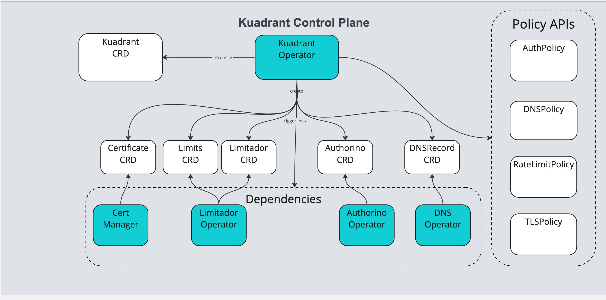
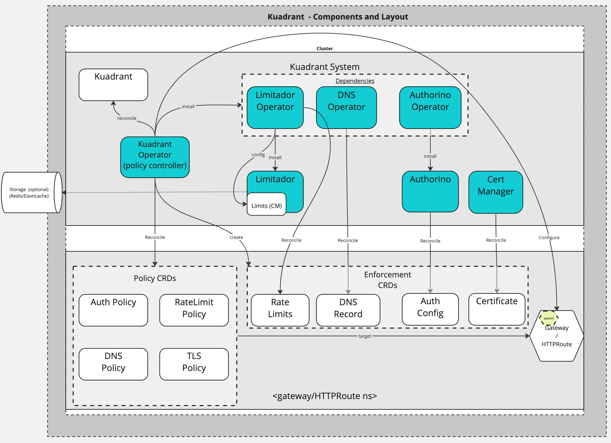

# Kuadrant Architectural Overview

<!--- variables for repeated links --->
[AuthPolicy]: https://docs.kuadrant.io/kuadrant-operator/doc/auth/
[RateLimitPolicy]: https://docs.kuadrant.io/kuadrant-operator/doc/rate-limiting/
[TLSPolicy]: https://github.com/Kuadrant/multicluster-gateway-controller/blob/main/docs/reference/tlspolicy.md
[DNSPolicy]: https://github.com/Kuadrant/multicluster-gateway-controller/blob/main/docs/reference/dnspolicy.md
[KuadrantCRD]: https://github.com/Kuadrant/kuadrant-operator/blob/main/doc/reference/kuadrant.md

## Overview

Kuadrant provides connectivity, security and service protection capabilities in both a single and multi-cluster environment. It exposes these capabilities in the form of Kubernetes CRDs that implement the [Gateway API](https://gateway-api.sigs.k8s.io) concept of [policy attachment](https://gateway-api.sigs.k8s.io/reference/policy-attachment/). These policy APIs can target specific Gateway API resources such as `Gateways` and `HTTPRoutes` to extend their capabilities and configuration. They enable platform engineers to secure, protect and connect their infrastructure and allow application developers to self service and refine policies to their specific needs in order to protect exposed endpoints.  

## Key Architectural Areas

* Kuadrant architecture is defined and implemented with both control plane and data plane components.
* The control plane is where policies are exposed and expressed as Kubernetes APIs and reconciled by a policy controller. 
* The data plane is where Kuadrant's "policy enforcement" components exist. These components are configured by the  control plane and integrate either directly with the Gateway provider or via external integrations.

## 10000m Architecture

### Control Plane Components and Responsibilities

The control plane is a set of controllers and operators that are responsible for for installation and configuration of other components such as the data plane enforcement components and configuration of the Gateway to enable the data plane components to interact with incoming requests. The control plane also owns and reconciles the policy CRD APIs into more complex and specific configuration objects that the policy enforcement components consume in order to know the rules to apply to incoming requests or the configuration to apply to external integrations such as DNS and ACME providers. 

#### [Kuadrant Operator](https://github.com/Kuadrant/Kuadrant-operator)
* Installation and configuration of other control plane components
* Installation of data plane policy enforcement components via their respective control plane operators
* Configures the Gateway via WASM plugin and other APIs to leverage the data plane components for auth and rate limiting on incoming requests.
* Exposes [`RateLimitPolicy`][RateLimitPolicy] , [`AuthPolicy`][AuthPolicy], [`DNSPolicy`][DNSPolicy] and [`TLSPolicy`][TLSPolicy] and reconciles these into enforceable configuration for the data plane.
* Exposes [`Kuadrant`][KuadrantCRD] and reconciles this to configure and trigger installation of the required data plane components and other control plane components.

#### [Limitador Operator:](https://github.com/Kuadrant/limitador-operator)
* Installs and configures the Limitador data plane component based on the Limitador CR. Limits specified in the limitador CR are mountd via configmap into the limitador component.

#### [Authorino Operator:](https://github.com/Kuadrant/authorino-operator)
* Installs and configures the Authorino data plane component based on the Authorino CR.

#### [Cert-Manager:](https://cert-manager.io/)
* Manages TLS certificates for our components and for the Gateways. Consumes Certificate resources created by Kuadrant operator in response to the TLSPolicy.

#### [DNS Operator](https://github.com/Kuadrant/dns-operator)
* DNS operator consumes DNSRecord resources that are configured via the DNSPolicy api and applies them into the targeted cloud DNS provider
AWS, Azure and Google DNS are our main targets

### Data Plane Components and Responsibilities

The data plane components sit in the request flow and are responsible for enforcing configuration defined by policy and providing service protection capabilities based on configuration managed and created by the control plane.

#### [Limitador](https://github.com/Kuadrant/limitador)
* Complies with the with Envoy rate limiting API to provide rate limiting to the gateway. Consumes limits from a configmap created based on the RateLimitPolicy API.

#### [Authorino](https://github.com/Kuadrant/authorino)
* Complies with the Envoy external auth API to provide auth integration to the gateway. It provides both Authn and Authz. Consumes AuthConfigs created by the kuadrant operator based on the defined `AuthPolicy` API.

#### [WASM Shim](https://github.com/Kuadrant/wasm-shim)
* Uses the [Proxy WASM ABI Spec](https://github.com/proxy-wasm/spec) to integrate with Envoy and provide filtering and connectivity to Limitador for request time enforcement of and rate limiting.

### Single Cluster Layout 

In a single cluster, you have the Kuadrant control plane and data plane sitting together. It is configured to integrate with Gateways on the same cluster and configure a DNS zone via a DNS provider secret (configured alongside a DNSPolicy). Storage of rate limit counters is possible but not required as they are not being shared.

### Multi-Cluster 

In the default multi-cluster setup. Each individual cluster has Kuadrant installed. Each of these clusters are unaware of the other. They are effectively operating as single clusters. The multi-cluster aspect is created by sharing access with the DNS zone, using a shared host across the clusters and leveraging shared counter storage. 
The zone is operated on independently by each of DNS operator on both clusters to form a single cohesive record set. More details on this can be found in the following RFC document: TODO add link.
The rate limit counters can also be shared and used by different clusters in order to provide global rate limiting. This is achieved by connecting each instance of Limitador to a shared data store that uses the Redis protocol. There is another option available for achieving multi-cluster connectivity (see intgrations below) that requires the use of a "hub" cluster and integration with OCM (open cluster management).

Shown above is a multi-cluster multi ingress gateway topology. This might be used to support a geographically distributed system for example. However, it is also possible to leverage overlay networking tools such as [Skupper](https://skupper.io) that integrate at the Kubernetes service level to have a single gateway cluster that then integrates with multiple backends (on different clusters or in custom infrastructure).

### Dependencies

#### [Istio](https://istio.io): **Required**
* Gateway API provider that Kuadrant integrates with via WASM and Istio APIS to provide service protection capabilities.
* Used by [`RateLimitPolicy`][RateLimitPolicy] and [`AuthPolicy`][AuthPolicy]
#### [Gateway API](https://github.com/kubernetes-sigs/gateway-api): **Required**
* New standard for Ingress from the Kubernetes community
* Gateway API is the core API that Kuadrant integrates with.

#### Integrations

#### [Open Cluster Manager](https://open-cluster-management.io/): **Optional**
* Provides a multi-cluster control plane to enable the defining and distributing of Gateways across multiple clusters.

While the default setup is to leverage a distributed configuration for DNS and rate limiting. There is also a component that offers experimental integration with Open Cluster Management. 

In this setup, the OCM integration controller is installed into the HUB alongside the DNS Operator and the cert-manager. This integration allows you to define gateways in the Hub and distribute them to "spoke" clusters. The addresses of these gateways are gathered from the spokes and aggregated back to the hub. The Kuadrant operator and DNS operator then act on this information as though it were a single cluster gateway with multiple addresses. The DNS zone in the configured DNS provider is managed centrally by one DNS operator instance.

![](./images/high-level-multi-clu