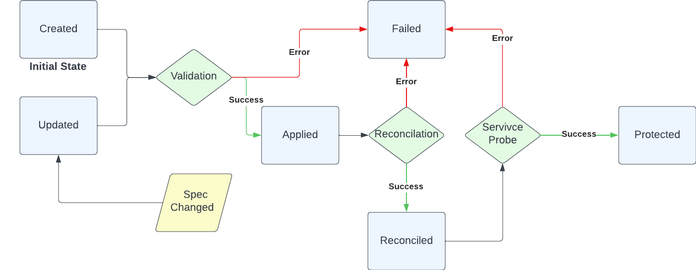

# RFC Template

- Feature Name: `policy_status_states`
- Start Date: 2023-02-03
- RFC PR: [Kuadrant/architecture#0009](https://github.com/Kuadrant/architecture/pull/9)
- Issue tracking: [Kuadrant/architecture#0000](https://github.com/Kuadrant/architecture/issues/0000)

# Summary
[summary]: #summary

This RFC proposes a new design for any Kuadrant Policy (`RateLimitPolicy`, `AuthPolicy`, etc..) Status definition and transitions.

# Motivation
[motivation]: #motivation

At the time being, the `RateLimitPolicy` and `AuthPolicy` Status doesn't clearly and truthfully communicate the actual state of
reconciliation and healthiness with its Operator managed services, mainly in this case the Rate Limit service `Limitador`, and
the Auth service `Authorino`.

As a consequence, only misleading information is shared causing unexpected errors and flawed assumptions.

The following are some issues addressing the before mentioned drawbacks:

* https://github.com/Kuadrant/kuadrant-operator/issues/87
* https://github.com/Kuadrant/kuadrant-operator/issues/96
* https://github.com/Kuadrant/kuadrant-operator/issues/140

# Guide-level explanation
[guide-level-explanation]: #guide-level-explanation

The following proposal it's divided in 3 stages, where each one could be applied/develop in order and would reflect valuable
and accurate information with different degrees of acuity. The Policy CRD Status in the following diagrams, are simplified
as states, which in the [Reference-level explanation](#reference-level-explanation) will be translated to the actual Status Conditions.

## Stage 1
**The state is defined by the application and validation of the Policy CR**

This first stage is a simple version where the operator only relies on itself, not checking the healthiness of its services
and just validating the Spec.

States rationale:

* `Created`: The initial state. It announces that the policy has successfully being created, the operator acknowledges it.
* `Applied`: This state is reached after the `Validation` event has being successfully passed.
* `Failed`: This one will be set when the `Validation` process encounters an error. This could be either condition's failed/error
state or a top-level condition.
* `Updated`: From `Failed` or `Applied`, it could be triggered a `Spec Change` event that will move it to this state.

## Stage 2
**A further reconciliation check provides a new state**

This following one, besides checking what the former stage does, it also adds the states reflecting the reconciliation
process of any needed Kubernets object, Kuadrant Services custom resources and any other 3rd party CR required.
An example would be in the case of the RLP, it will create/update the `ConfigMap` holding the `Limitador` config file.

   

States rationale:

* `Applied`: The __Applied__ state will not be final, and will be preceding a `Reconciliation` event.
* `Reconciled`: It communicates that the policy has successfully being reconciled, and any K8s object or required CR has been updated.
* `Failed`: This one will be reached when either of `Validation` and `Reconcilation` processes have encounter any errors.

## Stage 3
**A final health check of services refines the status**

The final stage will bring a greater degree of accuracy, thanks for a final process that will check the healthiness and 
configuration version the Kuadrant services currently enforces.

   

States rationale:

* `Reconciled`: This state will precede the "Health check" process  graphed as `Service Probe` event.
* `Enforced`: After a successful response of the `Service Probe`, this states communicates the policy is finally enforced.
This is the final top-level condition.
* `Failed`: Now this state could also be set after encountering errors in the `Service Probe` check.

# Reference-level explanation
[reference-level-explanation]: #reference-level-explanation

The stages before mentioned, will follow the [Kubernetes guidelines](https://github.com/kubernetes/community/blob/master/contributors/devel/sig-architecture/api-conventions.md#typical-status-properties) 
regarding the Status object definition.

**Conditions**

| Type       | Status | Reason                | Message                                           | Top Level |
|------------|--------|-----------------------|---------------------------------------------------|-----------|
| Created    | True   | "PolicyCreated"       | "KuadrantPolicy created"                          | No        |
| Updated    | True   | "PolicyUpdated"       | "KuadrantPolicy has been updated"                 | No        |
| Applied    | True   | "PolicyApplied"       | "KuadrantPolicy has been successfully applied     | Yes       |
|            | False  | "PolicyNotApplied"    | "KuadrantPolicy is invalid"                       |           |
| Reconciled | True   | "PolicyReconciled"    | "KuadrantPolicy has been successfully reconciled" | Yes       |
|            | False  | "PolicyNotReconciled" | "KuadrantPolicy failed reconciliation"            |           |
| Enforced   | True   | "PolicyEnforced"      | "KuadrantPolicy has been successfully enforced"   | Yes       |
|            | False  | "PolicyNotEnforced"   | "KuadrantPolicy has encountered an error"         |           |

A simplified version and more aligned with the Kubernetes objects implementation could be represented as the following.

**Conditions**

All conditions are top-level.

| Type        | Status | Reason                      | Message                                                   |
|-------------|--------|-----------------------------|-----------------------------------------------------------|
| Progressing | True   | "PolicyCreated"             | "KuadrantPolicy created"                                  |
|             | True   | "PolicyUpdated"             | "KuadrantPolicy has been updated"                         |
|             | True   | "PolicyApplied"             | "KuadrantPolicy has been successfully applied             |
|             | True   | "PolicyReconciled"          | "KuadrantPolicy has been successfully reconciled"         |
|             | False  | "PolicyEnforced"            | "KuadrantPolicy has been successfully enforced"           |
|             | False  | "PolicyError"               | "KuadrantPolicy has encountered an error"                 |
| Enforced    | True   | "PolicyEnforced"            | "KuadrantPolicy has been successfully enforced"           |
|             | False  | "PolicyNotEnforced"         | "KuadrantPolicy has encountered an error while enforcing" |
| Failed      | True   | "PolicyValidationError"     | "KuadrantPolicy has failed to validate"                   |
|             | True   | "PolicyReconciliationError" | "KuadrantPolicy has encountered a reconciliation error"   |
|             | True   | "PolicyServiceError"        | "KuadrantPolicy has encountered has failed to enforce"    |
|             | False  | "PolicyEnforced"            | "KuadrantPolicy has been successfully enforced"           |

### Notes
* The messages, the ones corresponding to the _falsey status_, might reflect the error that encountered.
* It's possible to have the _Failed_ state as a top level condition too. In this case might be useful to add a third 
"Unknown" status.

# Drawbacks
[drawbacks]: #drawbacks

- This proposal will require to change the code controllers assert the status
- Since the Status is part of the "API", won't be backwards compatible
- Documentation updating

# Rationale and alternatives
[rationale-and-alternatives]: #rationale-and-alternatives

-

# Prior art
[prior-art]: #prior-art

* [Kubernetes API Conventions](https://github.com/kubernetes/community/blob/master/contributors/devel/sig-architecture/api-conventions.md#spec-and-status)
* [Current KuadrantPolicy Status work](https://github.com/Kuadrant/kuadrant-operator/blob/main/controllers/KuadrantPolicy_status.go)

# Unresolved questions
[unresolved-questions]: #unresolved-questions

~~- Should this proposal extend to the KAP as well?~~
- Is it worthy to implement a state machine or state machine design pattern to achieve this set of conditions?

# Future possibilities
[future-possibilities]: #future-possibilities

~~A future work could include the extraction of the Status into a shared module, so both policies could benefit from it.~~
This proposal will be applied to both policies. It will also be part of the Kuadrant api-machinery repository.
