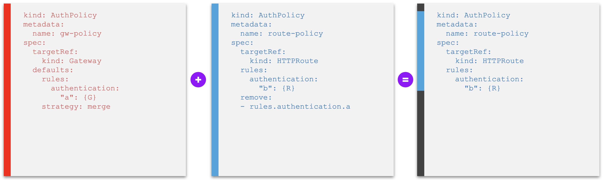
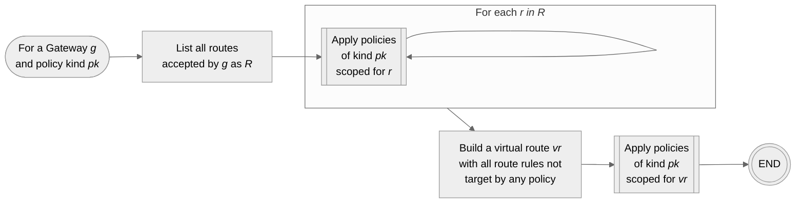
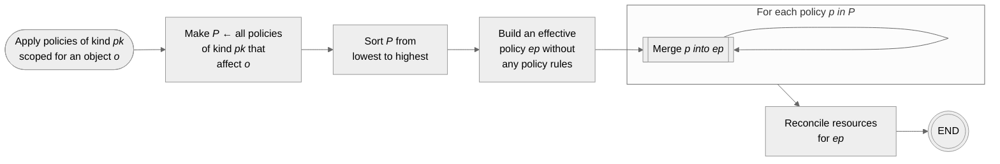
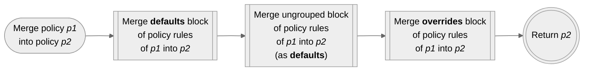
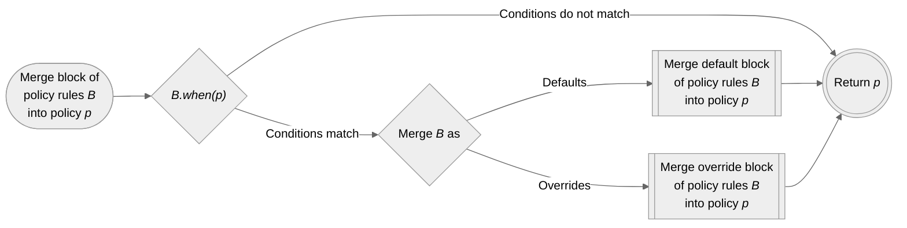
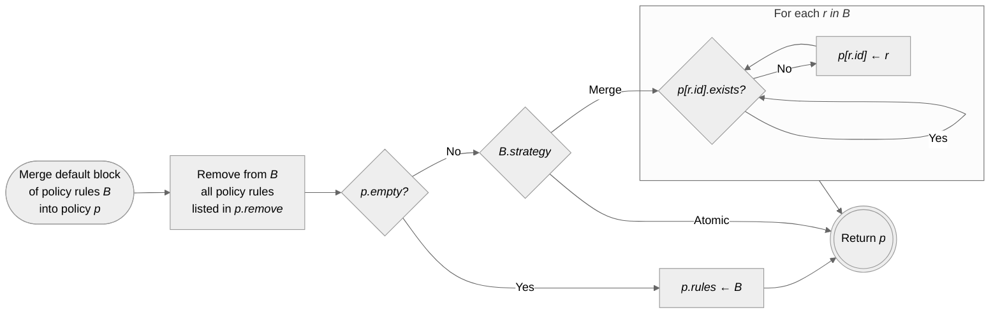
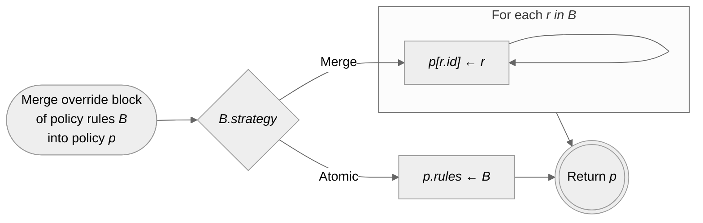

# Defaults & Overrides

- Feature Name: `defaults-and-overrides`
- Start Date: 2024-02-15
- RFC PR: [Kuadrant/architecture#58](https://github.com/Kuadrant/architecture/pull/58)
- Issue tracking: [Kuadrant/kuadrant-operator#431](https://github.com/Kuadrant/kuadrant-operator/issues/431)

# Summary
[summary]: #summary

This is a proposal for extending the Kuadrant Policy APIs to fully support use cases of **Defaults & Overrides (D/O)** for [Inherited Policies](https://gateway-api.sigs.k8s.io/geps/gep-713/#inherited-policy-attachment-its-all-about-the-defaults-and-overrides), including the base use cases of _full default_ and _full override_, and more specific nuances that involve merging individual policy rules (as defaults or overrides), declaring constraints and deactivating defaults.

# Motivation
[motivation]: #motivation

As of Kuadrant Operator [v0.6.0](https://github.com/Kuadrant/kuadrant-operator/releases/tag/v0.6.0), Kuadrant policy resources that have hierarchical effect across the tree of network objects (Gateway, HTTPRoute), or what is known as [Inherited Policies](https://gateway-api.sigs.k8s.io/geps/gep-713/#inherited-policy-attachment-its-all-about-the-defaults-and-overrides), provide only _limited support for setting defaults_ and _no support for overrides_ at all.

The above is notably the case of the AuthPolicy and the RateLimitPolicy v1beta2 APIs, shipped with the aforementioned version of Kuadrant. These kinds of policies can be attached to Gateways or to HTTPRoutes, with cascading effects through the hierarchy that result in one _effective policy_ per gateway-route combination. This effective policy is either the policy attached to the Gateway or, if present, the one attached to the HTTRoute, thus conforming with a strict case of _implicit defaults set at the level of the gateway_.

Enhancing the Kuadrant Inherited Policy CRDs, so the corresponding policy instances can declare `defaults` and `overrides` stanzas, is imperative:
1. to provide full support for D/O along the lines proposed by [GEP-713](https://gateway-api.sigs.k8s.io/geps/gep-713) (to be superseded by [GEP-2649](https://github.com/kubernetes-sigs/gateway-api/pull/2813)[^1]) of the Kubernetes Gateway API special group (base use cases);
2. to extend D/O support to other derivative cases, learnt to be just as important for platform engineers and app developers who require more granular policy interaction on top of the base cases;
3. to support more sophisticated hierarchies with other kinds of network objects and/or multiples policies targetting at the same level of the hierarchy (possibly, in the future.)

[^1]: As the time of writing, [GEP-713](https://gateway-api.sigs.k8s.io/geps/gep-713) (Kubernetes Gateway API, SIG-NETWORK) is [under revision](https://github.com/kubernetes-sigs/gateway-api/pull/2813), expected to be split into two separate GEPs, one for Direct Policies (GEP-2648) and one for Inherited Policies (GEP-2649.) Once these new GEPs supersede GEP-713, all references to the previous GEP in this document must be updated to GEP-2649.

# Guide-level explanation
[guide-level-explanation]: #guide-level-explanation

## Conceptialization and User story

The base use cases for Defaults & Overrides (D/O) are:
- **Defaults (D):** policies declared lower in the hierarchy supersede ones set (as "defaults") at a higher level, or _"more specific beats less specific"_
- **Overrides (O):** policies declared higher in the hierarchy (as "overrides") supersede ones set at the lower levels, or _"less specific beats more specific"_

The base cases are expanded with the following additional derivative cases and concepts:
- **Merged defaults (DR):** "higher" default policy rules that are merged into more specific "lower" policies (as opposed to an atomic less specific set of rules that is activated only when another more specific one is absent)
- **Merged overrides (OR):** "higher" override policy rules that are merged into more specific "lower" policies (as opposed to an atomic less specific set of rules that is activated fully replacing another more specific one that is present)
- **Constraints (C):** specialization of an override that, rather than declaring concrete values, specify higher level constraints (e.g., min value, max value, enums) for lower level values, with the semantics of "clipping" lower level values so they are enforced, in an override fashion, to be the boundaries dictated by the constraints; typically employed for constraining numeric values and regular patterns (e.g. limited sets)
- **Deactivation (RR):** specialization that completes a merge default use case by allowing lower level policies to disable ("deactivate") individual defaults set a higher level (as opposed to superseding those defaults with actual, more specific, policy rules with proper meaning there than nullify the default)

Together, these concepts relate to solve the following user stories:

| User story                                                                                                                                                                                                                                                                                          | Group | Unique ID                        |
|-----------------------------------------------------------------------------------------------------------------------------------------------------------------------------------------------------------------------------------------------------------------------------------------------------|:-----:|----------------------------------|
| As a Platform Engineer, when configuring a Gateway, I want to set a default policy for all routes linked to my Gateway, that can be fully replaced with more specific ones(*).                                                                                                                      | D     | **gateway-default-policy**       |
| As a Platform Engineer, when configuring a Gateway, I want to set default policy rules (parts of a policy) for all routes linked to my Gateway, that can be individually replaced and/or expanded by more specific rules(*).                                                                        | DR    | **gateway-default-policy-rule**  |
| As a Platform Engineer, when defining a policy that configures a Gateway, I want to set constraints (e.g. minimum/maximum value, enumerated options, etc) for more specific policy rules that are declared(*) with the purpose of replacing the defaults I set for the routes linked to my Gateway. | C     | **policy-constraints**           |
| As a Platform Engineer, when configuring a Gateway, I want to set a policy for all routes linked to my Gateway, that cannot be replaced nor expanded by more specific ones(*).                                                                                                                      | O     | **gateway-override-policy**      |
| As a Platform Engineer, when configuring a Gateway, I want to set policy rules (parts of a policy) for all routes linked to my Gateway, that cannot be individually replaced by more specific ones(*), but only expanded with additional more specific rules(\*).                                   | OR    | **gateway-override-policy-rule** |
| As an Application Developer, when managing an application, I want to set a policy for my application, that fully replaces any default policy that may exist for the application at the level of the Gateway, without having to know about the existence of the default policy.                      | D     | **route-replace-policy**         |
| As an Application Developer, when managing an application, I want to expand a default set of policy rules set for my application at the level of the gateway, without having to refer to those existing rules by name.                                                                              | D/O   | **route-add-policy-rule**        |
| As an Application Developer, when managing an application, I want to deactivate an individual default rule set for my application at the level of the gateway.                                                                                                                                      | RR    | **route-disable-policy-rule**    |

<sup>(*) declared in the past or in the future, by myself or any other authorized user.</sup>

The interactive nature of setting policies at levels in the hierarchy and by different personas, make that the following additional user stories arise. These are stories here grouped under the **Observability (Ob)** aspect of D/O, but referred to as well in relation to the ["Discoverability Problem"](https://gateway-api.sigs.k8s.io/geps/gep-713/#status-and-the-discoverability-problem) described by Gateway API.

| User story                                                                                                                                                                                                     | Group | Unique ID                   |
|----------------------------------------------------------------------------------------------------------------------------------------------------------------------------------------------------------------|:-----:|-----------------------------|
| As one who has read access to Kuadrant policies, I want to view the effective policy enforced at the traffic routed to an application, considering all active defaults and overrides at different policies(*). | Ob    | **view-effective-policy**   |
| As a Platform Engineer, I want to view all default policy rules that may have been replaced by more specific ones(*).                                                                                          | Ob    | **view-policy-rule-status** |
| As a Policy Manager, I want to view all gateways and/or routes whose traffic is subject to enforcement of a particular policy rule referred by name.                                                           | Ob    | **view-policy-rule-reach**  |

<sup>(*) declared in the past or in the future, by myself or any other authorized user.</sup>

## Writing D/O-enabled Kuadrant Policies

Writing a Kuadrant policy enabled for Defaults & Overrides (D/O), to be attached to a network object, involves declaring the following fields at the first level of the spec:

- `targetRef` (required): the reference to a hierarchical network object targeted by the policy, typed as a Gateway API [`PolicyTargetReference`](https://pkg.go.dev/sigs.k8s.io/gateway-api/apis/v1alpha2#PolicyTargetReference) or [`PolicyTargetReferenceWithSectionName`](https://pkg.go.dev/sigs.k8s.io/gateway-api/apis/v1alpha2#PolicyTargetReferenceWithSectionName) type
- `defaults`: a block of _default_ policy rules with further specification of a strategy (_atomic_ set of rules or individual rules to be _merged_ into lower policies), and optional conditions for applying the defaults down through the hierarchy
- `overrides`: a block of _override_ policy rules with further specification of a strategy (_atomic_ set of rules or individual rules to be _merged_ into lower policies), and optional conditions for applying the overrides down through the hierarchy
- the bare policy rules block without further qualification as a default or override set of rules – e.g. the `rules` field in a Kuadrant AuthPolicy, the `limits` field in a RateLimitPolicy.

Typically, one will specify either `defaults` and/or `overrides`, or just the bare set of policy rules block without further qualification as neither defaults nor overrides.

In case two or more of these fields are specified, they are processed in the following order:
1. `defaults`
2. bare set of policy rules without qualification (treated indistinctively as another block of defaults)
3. `overrides`

Supporting specifying the bare set of policy rules at the first level of the spec, as well and simultaneously along with `defaults` and `overrides` blocks, is a strategy that aims to provide:
1. more natural usability, especially for those who write policies attached to the lowest level of the hierarchy supported; as well as
2. backward compatibility for policies that did not support explicit D/O and later on have moved to doing so.

### Inherited Policies that _declare an intent_

A policy that does not specify D/O fields (`defaults`, `overrides`) is a policy that _declares an intent_.

One who writes a policy without specifying `defaults` or `overrides`, but only the bare set of policy rules, may feel like declaring a [_Direct Policy_](https://gateway-api.sigs.k8s.io/geps/gep-713/#direct-policy-attachment).
Depending on the state of other policies indirectly affecting the same object or not, the final outcome can be the same as writing a direct policy.
This is especially true when the policy that declares the intent targets an object whose kind is the lowest kind accepted by Kuadrant in the hierarchy of network resources, and there are no other policies with lower precedence.

Nevertheless, because other policies can affect the final behavior of the target (e.g. by injecting defaults, by overriding rules, by adding more definitions beneath), policies that simply declare an intent, conceptually, are still Inherited Policies.

Compared to the inherited policy that misses D/O blocks, these other policies affecting the behavior may be declared:
- at higher levels in the hierarchy,
- at lower levels in hierarchy, or even
- at the same level in the hierarchy but happening to have lower precedence (if such case is allowed by the kind of policy.)

At any time, any one of these policies can be created and therefore the final behavior of a target should never be assumed to be equivalent to the intent declared by any individual policy in particular, but always collectively determined by the combination of all intents, defaults and overrides from all inherited policies affecting the target.

From [GEP-2649](https://github.com/kubernetes-sigs/gateway-api/pull/2813):

> If a Policy can be used as an Inherited Policy, it MUST be treated as an Inherited Policy, regardless of whether a specific instance of the Policy is only affecting a single object.

An inherited policy that simply declares an intent (i.e. without specifying D/O) will be treated as a policy that implicitly declares an atomic set of _defaults_, whether the policy targets higher levels in the hierarchy or lower ones.
In the absence of any other conflicting policy affecting the same target, the _behavior_ equals the _defaults_ which equal the _intent_.

### Inherited Policies that _modify an intent_

A policy that specifies D/O fields (`defaults`, `overrides`) is a policy explicitly declared to _modify an intent_.

Without any other policy with lower precedence, there is no special meaning in choosing whether _defaults_ or _overrides_ in a inherited policy that targets an object whose kind is the lowest kind accepted by Kuadrant in the hierarchy of network resources.
The sets of rules specified in these policies affect indistinctively the targeted objects, regardless of how they are qualified.

However, because other policies may ocasionally be declared with lower precedence (i.e. targeting lower levels in the hierarchy or due to ordering, see [Conflict Resolution](https://gateway-api.sigs.k8s.io/geps/gep-713/#conflict-resolution)), one who declares a policy to modify an intent must carefuly choose between `defaults` and/or `overrides` blocks to organize the policy rules, regardless if the targeted object is of a kind that is the lowest kind in the hierarchy of network resources accepted by Kuadrant.

Even in the cases where no more than one policy of a kind is allowed to target a same object (1:1 relationship) and thus there should never exist two policies affecting a target from a same level of the hierarchy simultaneaously (or equivalently a policy with lower precedence than another, both at the lowest level of the hierarchy), users must assume that this constraint may change (i.e. N:1 relationship between policies of a kind and target become allowed.)

In all cases, _defaults_ and _overrides_ must be used with the semantics of declaring rules that modify an intent.
- When an intent does not specify a rule for which there is a higher default declared, the default modifies the intent by setting the value specified by the default.
- For an intent that whether specifies or omits a rule for which there is a higher override declared, the override modifies the intent by setting the value specified by the override.

### Identifying inherited policy kinds

All Custom Resource Definitions (CRDs) that define a Kuadrant inherited policy must be labeled `gateway.networking.k8s.io/policy: inherited`.

Users can rely on the presence of that label to identify policy kinds whose instances are treated as inhertied policies.

In some exceptional cases, there may be kinds of Kuadrant policies that do not specify `defaults` and `overrides` blocks, but that are still labeled as inherited policy kinds.
Instances of these kinds of policies implicitly declare an atomic sets of _defaults_, similarly to described in [Inherited Policies that declare an intent](#inherited-policies-that-declare-an-intent).

### Examples of D/O-enabled Kuadrant policy

**Example 1.** Atomic defaults

```yaml
kind: AuthPolicy
metadata:
  name: gw-policy
spec:
  targetRef:
    kind: Gateway
  defaults:
    rules:
      authentication:
        "a": {…}
      authorization:
        "b": {…}
    strategy: atomic
```

The above is a proper Inherited Policy that sets a **_default_ atomic set of auth rules** that will be set at lower objects in case those lower object do not have policies attached of their own at all.

The following is a sligthly different example that defines **auth rules** that will be **individually merged** into lower objects, evaluated one by one if already defined at the "lower" (more specific) level and therefore should take precedence, or if otherwise is missing at the lower level and therefore the default should be activated.

**Example 2.** Merged defaults

```yaml
kind: AuthPolicy
metadata:
  name: gw-policy
spec:
  targetRef:
    kind: Gateway
  defaults:
    rules:
      authentication:
        "a": {…}
      authorization:
        "b": {…}
    strategy: merge
```

Similarly, a set of `overrides` policy rules could be specified, instead or alongside with the `defaults` set of policy rules.

### Atomic vs. individually merged policy rules

There are 2 supported strategies for applying proper Inherited Policies down to the lower levels of the herarchy:
- **Atomic policy rules:** the bare set of policy rules in a `defaults` or `overrides` block is applied as an atomic piece; i.e., a lower object than the target of the policy, that is evaluated to be potentially affected by the policy, also has an atomic set of rules if another policy is attached to this object, therefore either the _entire_ set of rules declared by the higher (less specific) policy is taken or the _entire_ set of rules declared by the lower (more specific) policy is taken (depending if it's `defaults` or `overrides`), but the two sets are never merged into one.
- **Merged policy rules:** each _individual_ policy rule within a `defaults` or `overrides` block is compared one to one against lower level policy rules and, when they conflict (i.e. have the same key with different values), either one or the other (more specific or less specific) is taken (depending if it's `defaults` or `overrides`), in a way that the final effective policy is a merge between the two policies.

Each block of `defaults` and `overrides` must specify a `strategy` field whose value is set to either `atomic` or `merge`. If omitted, `atomic` is assumed.

#### Level of granularity of compared policy rules

Atomic versus merge strategies, as a specification of the `defaults` and `overrides` blocks, imply that there are only two levels of granularity for comparing policies _vis-a-vis_.

- `atomic` means that the level of granularity is the entire set of policy rules within the `defaults` or `overrides` block. I.e., the policy is atomic, or, equivalently, the final effective policy will be either one indivisible ("atomic") set of rules ("policy") or the other.

- For the `merge` strategy, on the other hand, the granularity is of each _named policy rule_, where the name of the policy rule is the key and the value is an atomic object that specifies that policy rule. The final effective policy will be a merge of two policies.

#### Matrix of D/O strategies and Effective Policy

When two policies are compared to compute a so-called _Effective Policy_ out of their sets of policy rules and given default or override semantics, plus specified `atomic` or `merge` strategies, the following matrix applies:

|                | Atomic (entire sets of rules)                                                                                                | Merge (individual policy rules at a given granularity)                                                                                                                         |
|----------------|------------------------------------------------------------------------------------------------------------------------------|--------------------------------------------------------------------------------------------------------------------------------------------------------------------------------|
| **Defaults**   | More specific _entire_ set of rules beats less specific _entire_ set of rules → takes all the rules from the _lower_ policy  | More specific _individual_ policy rules beat less specific _individual_ set of rules → compare one by one each pair of policy rules and take the _lower_ one if they conflict  |
| **Overrides**  | Less specific _entire_ set of rules beats more specific _entire_ set of rules → takes all the rules from the _higher_ policy | Less specific _individual_ policy rules beat more specific _individual_ set of rules → compare one by one each pair of policy rules and take the _higher_ one if they conflict |

The order of the policies, from less specific (or "higher") to more specific (or "lower), is determined according to the [Gateway API hierarchy of network resources](https://gateway-api.sigs.k8s.io/geps/gep-713/#hierarchy), based on the kind of the object targeted by the policy. The policy that sets higher in the hierarchy dictates the strategy to be applied.

For a more detailed reference, including how to resolve conflicts in case of policies targeting objects at the same level, see GEP-713's section [Hierarchy](https://gateway-api.sigs.k8s.io/geps/gep-713/#hierarchy) and [Conflict Resolution](https://gateway-api.sigs.k8s.io/geps/gep-713/#conflict-resolution).

## Examples of D/O cases

The following sets of examples generalize D/O applications for the presented [user stories](#conceptialization-and-user-story), regardless of details about specific personas and kinds of targeted resources. They illustrate the expected behavior for different cases involving defaults, overrides, constraints and deactivations.

| Examples                                                                                                                                                | Highlighted user stories                           |
|---------------------------------------------------------------------------------------------------------------------------------------------------------|----------------------------------------------------|
| [A. Default policy entirely replaced by another at lower level](#examples-a---default-policy-entirely-replaced-by-another-at-lower-level)               | gateway-default-policy, route-replace-policy       |
| [B. Default policy rules merged into policies at lower level](#examples-b---default-policy-rules-merged-into-policies-at-lower-level)                   | gateway-default-policy-rule, route-add-policy-rule |
| [C. Override policy entirely replacing other at lower level](#examples-c---override-policy-entirely-replacing-other-at-lower-level)                     | gateway-override-policy                            |
| [D. Override policy rules merged into other at lower level](#examples-d---override-policy-rules-merged-into-other-at-lower-level)                       | gateway-override-policy-rule                       |
| [E. Override policy rules setting constraints to other at lower level](#examples-e---override-policy-rules-setting-constraints-to-other-at-lower-level) | policy-constraints                                 |
| [F. Policy rule that deactivates default from higher level](#examples-f---policy-rule-that-deactivates-default-from-higher-level)                       | route-disable-policy-rule                          |

In all the examples, a Gateway and a HTTPRoute objects are targeted by two policies, and an effective policy is presented highlighting the expected outcome. This poses no harm to generalizations involving same or different kinds of targeted resources, multiples policies targeting a same object, etc.

The leftmost YAML is always the "higher" (less specific) policy; the one in the middle, separated from the leftmost one by a "+" sign, is the "lower" (more specific) policy; and the rightmost YAML is the expected _Effective Policy_.

For a complete reference of the order of hierarchy, from least specific to most specific kinds of resources, as well as how to resolve conflicts of hierarchy in case of policies targeting objects at the same level, see Gateway API's [Hierarchy](https://gateway-api.sigs.k8s.io/geps/gep-713/#hierarchy) definition for Policy Attachment and [Conflict Resolution](https://gateway-api.sigs.k8s.io/geps/gep-713/#conflict-resolution).

### Examples A - Default policy entirely replaced by another at lower level

**Example A1.** A _default_ policy that is _replaced entirely_ if another one is set at a lower level


### Examples B - Default policy rules merged into policies at lower level

**Example B1.** A _default_ policy whose rules are _merged into other policies_ at a lower level, where individual default policy rules can be overridden or deactivated - _without conflict_


**Example B2.** A _default_ policy whose rules are _merged into other policies_ at a lower level, where individual default policy rules can be overridden or deactivated - _with conflict_


### Examples C - Override policy entirely replacing other at lower level

**Example C1.** An _override_ policy that _replaces any other_ that is set at a lower level _entirely_


### Examples D - Override policy rules merged into other at lower level

**Example D1.** An _override_ policy whose rules are _merged into other policies_ at a lower level, overriding individual policy rules with same identification - _without conflict_


**Example D2.** An _override_ policy whose rules are _merged into other policies_ at a lower level, overriding individual policy rules with same identification - _with conflict_


### Examples E - Override policy rules setting constraints to other at lower level

The examples in this section introduce the proposal for a new `when` field for the `defaults` and `overrides` blocks. This field dictates the conditions to be found in a lower policy that would make a higher policy or policy rule to apply, according to the corresponding `defaults` or `overrides` semantics and `atomic` or `merge` strategy.

Combined with a simple case of override policy (see [Examples C](#examples-c---override-policy-entirely-replacing-other-at-lower-level)), the `when` condition field allows modeling for use cases of setting constraints for lower-level policies.

As here proposed, the value of the `when` condition field must be a valid [Common Expression Language (CEL)](https://github.com/google/cel-spec) expression.

**Example E1.** An _override_ policy whose rules _set constraints_ to field values of other policies at a lower level, overriding individual policy values of rules with same identification if those values violate the constraints - _lower policy is compliant with the constraint_


**Example E2.** An _override_ policy whose rules _set constraints_ to field values of other policies at a lower level, overriding individual policy values of rules with same identification if those values violate the constraints - _lower level violates the constraint_


**Example E3.** An _override_ policy whose rules _set constraints_ to field values of other policies at a lower level, overriding individual policy values of rules with same identification if those values violate the constraints - _merge granularity problem_

The following example illustrates the possibly unintended consequences of enforcing D/O at [strict levels of granularity](#level-of-granularity-of-compared-policy-rules), and the flip side of the `strategy` field offering a closed set of options (`atomic`, `merge`).

On one hand, the API is simple and straightforward, and there are no deeper side effects to be concerned about, other than at the two levels provided (atomic sets or merged individual policy rules.) On the other hand, this design may require more offline interaction between the actors who manage conflicting policies.


### Examples F - Policy rule that deactivates default from higher level

The examples in this section introduce a new field `remove: []string` at the same level as the bare set of policy rules. The value of this field, provided as a list, dictates the default policy rules declared at a higher level to be deactivated ("removed") from the effective policy, specified by name of the policy rules.

**Example F1.** A policy that _deactivates_ a _default_ policy rule set at a higher level



**Example F2.** A policy that tries to _deactivate_ an _override_ policy rule set a higher level


# Reference-level explanation
[reference-level-explanation]: #reference-level-explanation

## Applying policies

The following diagrams are a high level model to guide the process of applying a set of policies of a kind for a given Gateway object, where the Gateway object is considered the root of a hierarchy, and for all objects beneath, being the xRoute objects the leaves of the hierarchical tree.

As presented, policies can target either Gateways of route objects (HTTPRoutes, GRPCRoutes), with no restriction regarding the number of policies of a kind that target a same particular object. I.e. N:1 relationship allowed. Without any loss of generality, 1:1 relationship between policies of a kind and targeted objects can be imposed if preferred as a measure to initially reduce the blast of information for the user and corresponding cognitive load.

### Apply policies to a Gateway (root object) and all objects beneath



### Apply policies of a kind for an object



### Merging two policies together



### Merging a generic block of policy rules (defaults or overrides) into a policy with conditions



### Merge a `defaults` block of policy rules into a policy



### Merge an `overrides` block of policy rules into a policy



## Implementation tiers

This section proposes a possible path for the implementation of this RFC for Kuadrant's existing kinds of policies that are affected by D/O – notably AuthPolicy and RateLimitPolicy.

The path is divided in 3 tiers that could be delivered in steps, additionaly to a series of enhancements & refactoring.

### Tier 1

- Atomic defaults (currently supported; missing addition of the `defaults` field to the APIs)
- Atomic overrides
- Reporting of effective policy
- CRD labels `gateway.networking.k8s.io/policy: inherited | direct`

### Tier 2

- D/O `when` conditions (and support for "constraints")
- Merge strategy

### Tier 3

- Deactivations
- Metrics for D/O policies (control plane)
- Docs: possible approaches for ["requirements"](#policy-requirements)

### Enhancements and refactoring

- Extract generic part of D/O implementation to [Kuadrant/gateway-api-machinery](https://github.com/Kuadrant/gateway-api-machinery).

# Drawbacks
[drawbacks]: #drawbacks

WIP

# Rationale and alternatives
[rationale-and-alternatives]: #rationale-and-alternatives

## Mutually exclusive API designs

The following alternatives were considered for the design of the API spec to support D/O:
1. [`strategy` field](#design-option-strategy-field) - RECOMMENDED
2. [`granularity` field](#design-option-granularity-field)
3. [`when` conditions (at any level of the spec)](#design-option-when-conditions-at-any-level-of-the-spec)
4. [CEL functions (at any level of the spec)](#design-option-cel-functions-at-any-level-of-the-spec)
5. [“path-keys”](#design-option-path-keys)
6. [JSON patch-like](#design-option-json-patch-like)

All the examples in the RFC are based on API design **`strategy` field**.

### Design option: `strategy` field

Each block of `defaults` and `overrides` specify a field `strategy: atomic | merge`, with `atomic` assumed if the field is omitted.

All the examples in the RFC are based on this design for the API spec.

Some of the implications of the design are explained in the section [Atomic vs. individually merged policy rules](#atomic-vs-individually-merged-policy-rules), with highlights to the support for specifying the level of atomicity of the rules in the policy based on only 2 granularities – entire set of policy rules (`atomic`) or to the level of each named policy rule (`merge`.)

<table>
  <thead>
    <tr>
      <th>✅ Pros</th>
      <th>❌ Cons</th>
    </tr>
  </thead>
  <tbody>
    <tr>
      <td>
        <ul>
          <li>Same schema as a normal policy without D/O</li>
          <li>Declarative</li>
          <li>Safe against "unmergeable objects" (e.g. two rules declaring different one-of options)</li>
          <li>Strong types</li>
          <li>Extensible (by adding more fields, e.g.: to support deactivations)</li>
          <li>Easy to learn</li>
        </ul>
      </td>
      <td>
        <ul>
          <li>2 levels of granularity only – either all (‘atomic’) or policy rule (‘merge’)</li>
          <li>1 granularity declaration per D/O block → declaring both ‘atomic’ and ‘merge’ simultaneously requires 2 separate policies targeting the same object</li>
        </ul>
      </td>
    </tr>
  </tbody>
</table>

The design option based on the `strategy` field is the RECOMMENDED design for the implementation of Kuadrant Policies enabled for D/O. This is due to the pros above, plus the fact that this design can evolve to other, more versatile forms, such as [**`granularity` field**](#design-option-granularity-field), [**`when` conditions**](#design-option-when-conditions-at-any-level-of-the-spec) or [**CEL functions**](#design-option-cel-functions-at-any-level-of-the-spec), in the future, while the opposite would be harder to achieve.

### Design option: `granularity` field

Each block of `defaults` and `overrides` would specify a `granularity` field, set to a numeric integer value that describes which level of the policy spec, from the root of the set of policy rules until that number of levels down, to treat as the key, and the rest as the atomic value.

Example:

```yaml
kind: AuthPolicy
metadata:
  name: gw-policy
spec:
  targetRef:
    kind: Gateway
  defaults:
    rules:
      authentication:
        "a": {…}
      authorization:
        "b": {…}
    granularity: 0 # the entire spec ("rules") is an atomic value
  overrides:
    rules:
      metadata:
        "c": {…}
      response:
        "d": {…}
    granularity: 2 # each policy rule ("c", "d") is an atomic value
```

<table>
  <thead>
    <tr>
      <th>✅ Pros</th>
      <th>❌ Cons</th>
    </tr>
  </thead>
  <tbody>
    <tr>
      <td>
        <ul>
          <li>Same as design option <a href="#design-option-strategy-field"><b><code>strategy</code> field</b></a></li>
          <li>Unlimited levels of granularity (values can be pointed as atomic at any level)</li>
        </ul>
      </td>
      <td>
        <ul>
          <li>1 granularity declaration per D/O block → <i>N</i> levels simultaneously require <i>N</i> policies</li>
          <li>Granularity specified as a number - user needs to count the levels</li>
          <li>Setting a deep level of granularity can cause merging "unmergeable objects"</li>
        </ul>
      </td>
    </tr>
  </tbody>
</table>

### Design option: `when` conditions (at any level of the spec)

Inspired by the extension of the API for D/O with an additional `when` field (see [Examples E](#examples-e---override-policy-rules-setting-constraints-to-other-at-lower-level)), this design alternative would use the presence of this field to signal the granularity of the atomic operation of default or override.

Example:

```yaml
kind: AuthPolicy
metadata:
  name: gw-policy
spec:
  targetRef:
    kind: Gateway
  defaults:
    rules:
      authentication:
        "a": {…}
        when: CEL # level 1 - entire "authentication" block
      authorization:
        "b":
          "prop-1": {…}
          when: CEL # level 2 - "b" authorization policy rule
```

<table>
  <thead>
    <tr>
      <th>✅ Pros</th>
      <th>❌ Cons</th>
    </tr>
  </thead>
  <tbody>
    <tr>
      <td>
        <ul>
          <li>Same as <a href="#design-option-granularity-field"><b><code>granularity</code> field</b></a></li>
          <li>As many granularity declarations per D/O block as complex objects in the policy</li>
          <li>Granularity specified “in-place”</li>
        </ul>
      </td>
      <td>
        <ul>
          <li>Setting a deep level of granularity can cause merging "unmergeable objects"</li>
          <li>Implementation nightmare - hard to define the API from existing types</li>
        </ul>
      </td>
    </tr>
  </tbody>
</table>

### Design option: CEL functions (at any level of the spec)

This design option leans on the power of [Common Expression Language (CEL)](https://github.com/google/cel-spec), extrapolating the design alternative with [**`when` conditions**](#design-option-when-conditions-at-any-level-of-the-spec) beyond declaring a CEL expression just to determine if a statically declared value should apply. Rather, it proposes the use of [CEL functions](https://github.com/google/cel-spec/blob/master/doc/langdef.md#functions) that outputs the value to default to or to ovrride with, taking the conflicting "lower" value as input, with or without a condition as part of the CEL expression. The value of a key set to a CEL function indicates the level of granularity of the D/O operation.

Example:

```yaml
kind: AuthPolicy
metadata:
  name: gw-policy
spec:
  targetRef:
    kind: Gateway
  defaults:
    rules:
      authentication:
        "a": {…} # static value
        "b": "cel:self.value > 3 ? AuthenticationRule{value: 3} : self"
      authorization: |
        cel:Authorization{
          c: AuthorizationRule{prop1: "x"}
        }
```

<table>
  <thead>
    <tr>
      <th>✅ Pros</th>
      <th>❌ Cons</th>
    </tr>
  </thead>
  <tbody>
    <tr>
      <td>
        <ul>
          <li>Unlimited levels of granularity</li>
          <li>Granularity specified “in-place”</li>
          <li>Extremely powerful</li>
          <li>Elegant and simple implementation-wise</li>
        </ul>
      </td>
      <td>
        <ul>
          <li>Weakly typed</li>
          <li>Implementation completely new – cannot reuse current API types</li>
          <li>Requires all types to be defined as protobufs</li>
          <li>Without strong guardrails, users can easily shoot themselves in the foot</li>
          <li>Validation likely requires complex functions for parsing the CEL expressions</li>
          <li>Non-declarative</li>
        </ul>
      </td>
    </tr>
  </tbody>
</table>

### Design option: “path-keys”

A more radical alternative considered consisted of defining `defaults` and `overrides` blocks whose schemas would not match the ones of a normal policy without D/O. Instead, these blocks would consist of simple key-value pairs, where the keys specify the paths in an affected policy where to apply the value atomically.

Example:

```yaml
kind: AuthPolicy
metadata:
  name: gw-policy
spec:
  targetRef:
    kind: Gateway
  defaults:
    "rules.authentication":
      "a": {G}
    "rules.authorization.b": {G}
```

<table>
  <thead>
    <tr>
      <th>✅ Pros</th>
      <th>❌ Cons</th>
    </tr>
  </thead>
  <tbody>
    <tr>
      <td>
        <ul>
          <li>D/O as simple key-value sets (keys: where to apply, values: what to apply)</li>
          <li>Declarative</li>
          <li>Unlimited levels of granularity (values can be pointed as atomic at any level)</li>
          <li>Unlimited merge declarations per D/O block</li>
          <li>Intuitive, easy-to-learn</li>
        </ul>
      </td>
      <td>
        <ul>
          <li>Not same schema as the normal policy (without D/O) - not very GWAPI-like</li>
          <li>Weakly typed (i.e. <code>map[string]any)</code></li>
          <li>Not extensible (e.g., cannot add other fields to the API)</code></li>
        </ul>
      </td>
    </tr>
  </tbody>
</table>

### Design option: JSON patch-like

Similar to the [**path-keys**](#design-option-path-keys) design option, inspired by [JSON patch](https://jsonpatch.com/) operations, to provide more kinds of operations and extensibility.

Example:

```yaml
kind: AuthPolicy
metadata:
  name: gw-policy
spec:
  targetRef:
    kind: Gateway
  defaults:
  - path: rules.authentication
    operation: add
    value: { "a": {G} }
  - path: rules.authorization.b
    operation: remove
  - path: |
      rules.authentication.a.
      value
    operation: le
    value: 50
```

<table>
  <thead>
    <tr>
      <th>✅ Pros</th>
      <th>❌ Cons</th>
    </tr>
  </thead>
  <tbody>
    <tr>
      <td>
        <ul>
          <li>Same as <a href="#design-option-path-keys"><b>"path-keys" field</b></a></li>
          <li>Extensible, all kinds of operations supported (add, remove, constraint)</li>
        </ul>
      </td>
      <td>
        <ul>
          <li>Not same schema as the normal policy (without D/O) - not very GWAPI-like</li>
          <li>Less declarative</li>
          <li>Weakly typed (i.e. <code>value: any)</code></li>
        </ul>
      </td>
    </tr>
  </tbody>
</table>

# Prior art
[prior-art]: #prior-art

WIP

# Out of scope

## Policy requirements

A use case often described in association with D/O is the one for declaring _policy requirements_. These are high level policies that declare requirements to be fulfilled by more specific (lower level) policies without specifying concrete default or override values nor constraints. E.g.: "an authentication policy must be enforced, but none is provided by default."

A typical generic policy requirement user story is:

> _As a Platform Engineer, when configuring a Gateway, I want to set policy requirements to be fulfilled by one who manages an application/route linked to my Gateway, so all interested parties, including myself, can be aware of applications deployed to the cluster that lack a particular policy protection being enforced._

Policy requirements as here described are out of scope of this RFC.

We believe policy requirement use cases can be stated and solved as an observability problem, by defining metrics and alerts that cover for missing policies or policy rules, without necessarily having to write a policy of the same kind to express such requirement to be fulfilled.

# Unresolved questions
[unresolved-questions]: #unresolved-questions

WIP

# Future possibilities
[future-possibilities]: #future-possibilities

WIP
